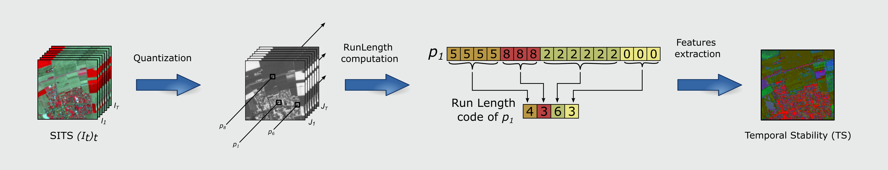

# Spatio-temporal stability analysis
Spatio-temporal features extraction that measure the stabilty. The proposed method is based on a compression algorithm named Run Length Encoding. The workflow of the method is presented bellow.



# Installation
Requierment packages installation
```bash
conda install scikit-image scikit-learn opencv gdal
```
To use the Temporal Stability class, you need to compile the ``C++`` code first. 

The compilation is done by executing the following command:

```bash
python setup.py build_ext --inplace
```

# Getting Started

This minimal working example

```python
st = TS.TemporelStability(n_clusters, miniBtach, data="all")
date_vec = np.arange(frames.shape[0]) # or rank of available days in the year

# Quantification of values
st.fit(frames)

# Compute the Temporal stability with the strict equality
ts = st.get_TS(date_vec)

# Compute the Temporal stability with the relaxed equality on temporal domain
ts_t = st.get_TS_t(date_vec)

# Compute the Temporal stability with the relaxed equality on spatial domain
ts_s = st.get_TS_s(date_vec)

# Compute the Temporal stability with the relaxed equality on spatio-temporal domain
ts_st = st.get_TS_st(date_vec)
```


# Example: Stability analysis of Sentinel-2 Satellite Image Time Series

TO DO


# Reference
If you re-use this work, please cite:

```
@inproceedings{chelali2_ICPRAI_2020,
  title={Spatio-temporal stability analysis in Satellite Image Times Series},
  year={2020},
  booktitle={International Conference on Pattern Recognition and Artificial Intelligence, ICPRAI 2020},
  pages={484--499},
  author={Chelali, M. and Kurtz, C. and Puissant, A. and Vincent, N.},
  url={https://link.springer.com/chapter/10.1007/978-3-030-59830-3_42}
}

@inproceedings{mchelali_jurse_2019,
  author = {Chelali, M. and Kurtz, C. and Puissant, A. and Vincent, N.},
  title = {Urban land cover analysis from satellite image time series based on temporal stability},
  booktitle = {Joint Urban Remote Sensing Event, JURSE 2019, IEEE Geoscience and Remote Sensing Society.},
  year = {2019},
  pages = {1--4},
  url = "https://ieeexplore.ieee.org/abstract/document/8808967"
}
```
